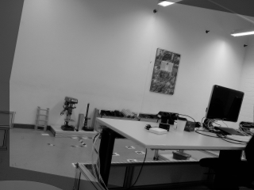

  
   
  

imreg_fmt is an implementation of the Fourier-Mellin transform-based image registration method originally described by Reddy and Chatterji [1].
Given a pair of images, the algorithm computes the translation (x, y), scale and rotation required to register/align one image to the other.
A brief explanation of the algorithm is provided [here](https://sthoduka.github.io/imreg_fmt/docs/overall-pipeline/).

This project is a partial port of the Python implementation by Christoph Gohlke and Matěj Týč (see [here](https://github.com/matejak/imreg_dft)).
It is written in C++ and is suited for registering a sequence of images (such as from a video).
For images of size 320x240, the algorithm runs at approximately 14 Hz on an Intel Core i3 (1.7 GHz).

Dependencies
------------
* fftw3 (sudo apt install libfftw3-dev)
* OpenCV 4.2
* Eigen (sudo apt install libeigen3-dev)

Compile
-------
    mkdir build && cd build
    cmake -DCMAKE_BUILD_TYPE=Release ..
    make

Mac OS X
--------
* You might have to add the following flag when running cmake (see [here](https://github.com/sthoduka/imreg_fmt/issues/2))

  `cmake -DCMAKE_BUILD_TYPE=Release -DCMAKE_CXX_FLAGS='-isystem /usr/local/include' ..`

OpenCV Phase Correlate
----------------------
As reported by [brht0](https://github.com/brht0) in this [issue](https://github.com/sthoduka/imreg_fmt/issues/15), the performance of the phaseCorrelate function from OpenCV is much faster (leading to ~3x improvement in speed). Thus by default, the code now uses the OpenCV function. To enable the original function, set the variable `USE_OPENCV_PHASECORRELATE=OFF` (and `ON` to go back to OpenCV) as follows and `make` again:

    cmake -DCMAKE_BUILD_TYPE=Release -DUSE_OPENCV_PHASECORRELATE=OFF ..

There are minor differences in the final output from the two methods. In some initial tests, there was up to 0.8 pixel difference (and very minimal difference in rotation and scale) for a given pair of images.

Run
---
    ./image_main <path to first image> <path to second image>
    ./video_main <path to video>

License
-------
This project is licensed under the [GPLv3 License](LICENSE). The license of the original Python version by Gohlke and Týč can be found [here](LICENSE-ORIGINAL).

References
----------
[1] B. S. Reddy and B. N. Chatterji, “An FFT-based Technique for Translation,
Rotation, and Scale-Invariant Image Registration,” IEEE Transactions on Image Processing, vol. 5, no. 8, pp. 1266–1271, 1996.

Other Repositories
------------------
You might be interested in some of the following repositories:

* [imreg_dft](https://github.com/matejak/imreg_dft): Python implementation
* [fourier-mellin](https://github.com/brht0/fourier-mellin): C++ implementation with Python bindings
* [LogPolarFFTTemplateMatcher](https://github.com/Smorodov/LogPolarFFTTemplateMatcher): C++ implementation
* [o-eFMT](https://github.com/STAR-Center/o-eFMT): extension which performs better in scenarios where the scene depth is not uniform (see [paper](https://www.mdpi.com/2072-4292/13/5/1000))
